# Lifting Log

## Overview

Log your lifts and keep track of your progress with Lifting Log! Set goals for yourself and be notified when you have reached them.

Lifting Log is a web app for strength training and weight lifting. Once a user is registered, they can log in and start logging their exercises. They can select an exercise from a list of exercises and record the number of sets, the number of reps, and the weight. They can view their past workout history in list form or graph form. They can set goals for themselves and compare their one rep max performance against other lifters at their bodyweight. 

## Data Model

The application will store Users, Exercises, and Logs.

* users can have multiple exercises (via references)
* each exercise must have an associated user (via reference)
* each exercise can have multiple logs (by embedding)
* each log must have an associated exercise (via reference)

An Example User:

```javascript
{
  username: "dozen_eggs",
  hash: // a password hash,
  gender: "Female",
  bodyweight: "150",
  exercises: // an array of references to Exercise documents
}
```

An Example Exercise:

```javascript
{
  user: // a reference to a User object
  name: "Bench Press",
  logs: [
    { exercise: /*reference to Exercise document*/, createdAt: "1585765350694", sets: "3", reps: "5", weight: "80"},
    { exercise: /*reference to Exercise document*/, createdAt: "1585765372594", sets: "2", reps: "1", weight: "110"},
    { exercise: /*reference to Exercise document*/, createdAt: "1585768297257", sets: "5", reps: "5", weight: "85"}
  ],
  oneRepMax: "110", 
  percentile: "36",
  goal: "150"
}
```


## [Link to Commented First Draft Schema](db.js) 


## Wireframes

/ - home page

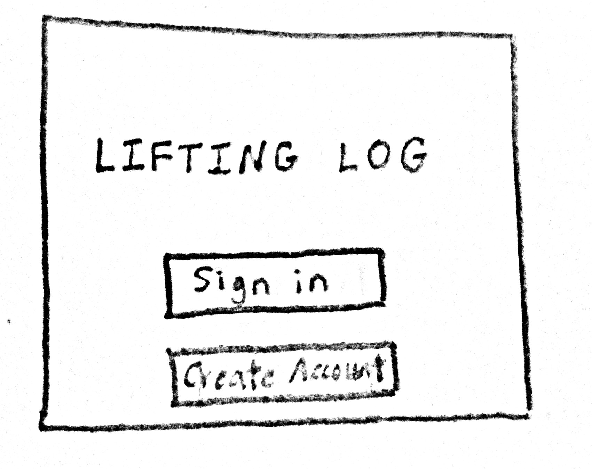

/signin - page for registered users to sign in

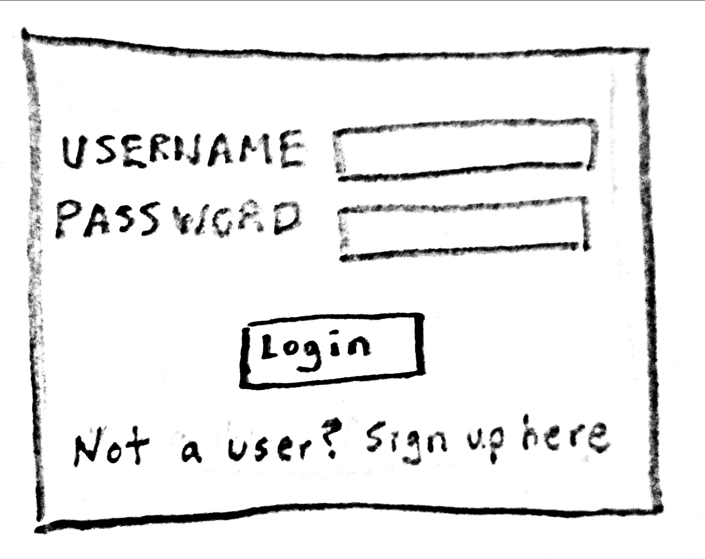

/register - page for non-registered users to make an account

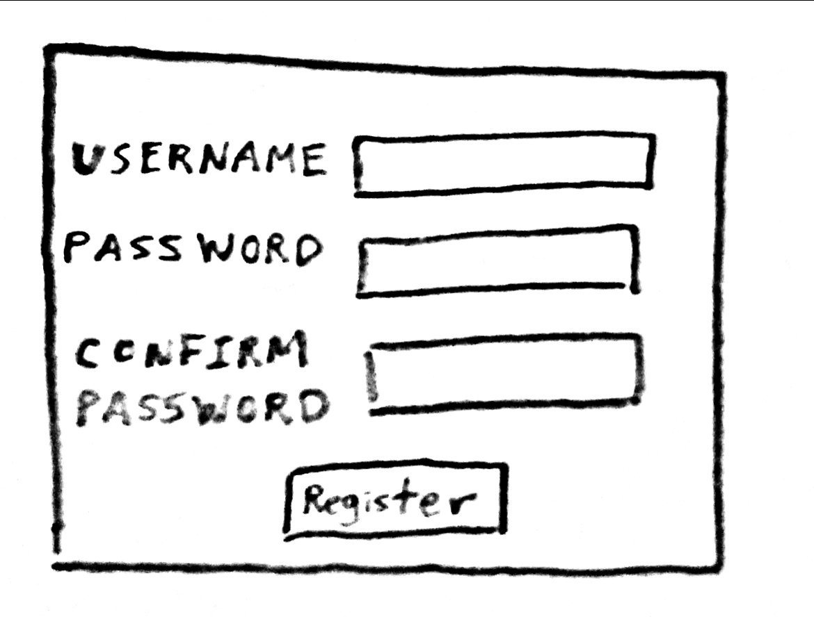

/create-profile - page for new users to set up their profile

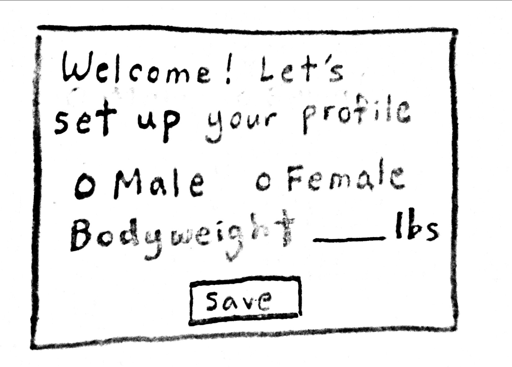

/tracker - page to view today's workout log and navigate to past or future dates

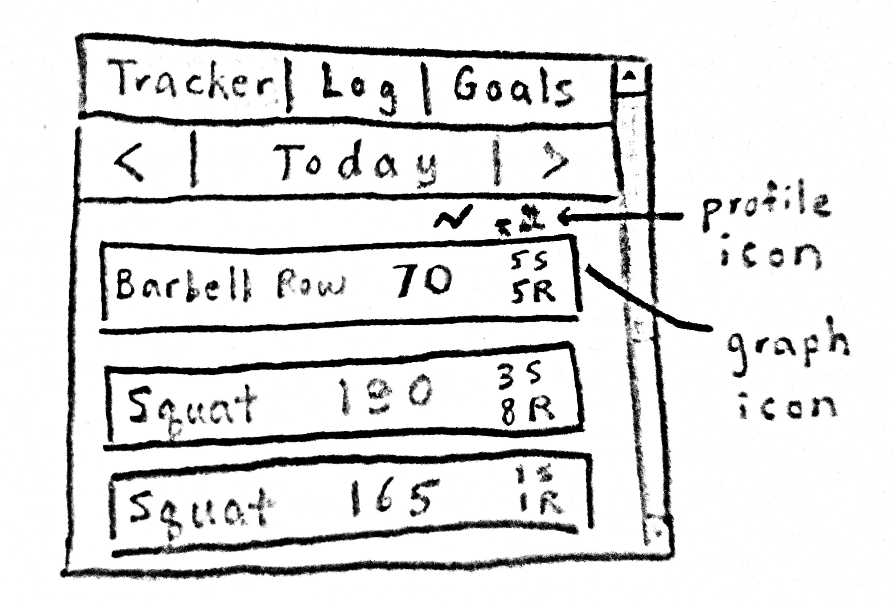

/profile - page to view and edit profile 

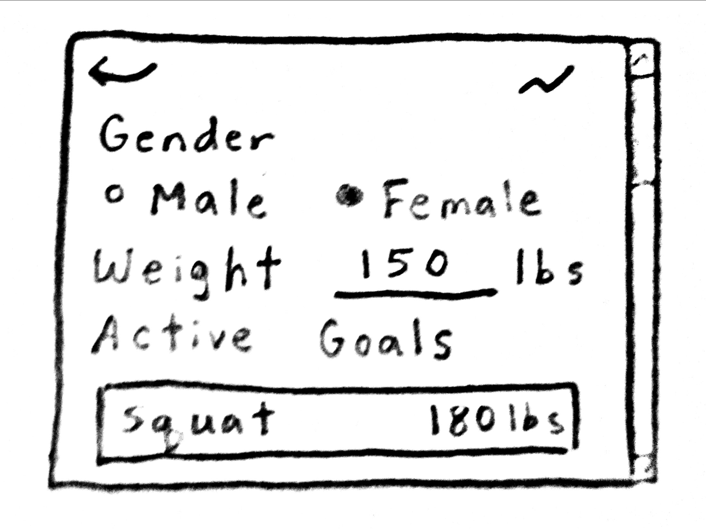

/graph - page to view graph of workout progress

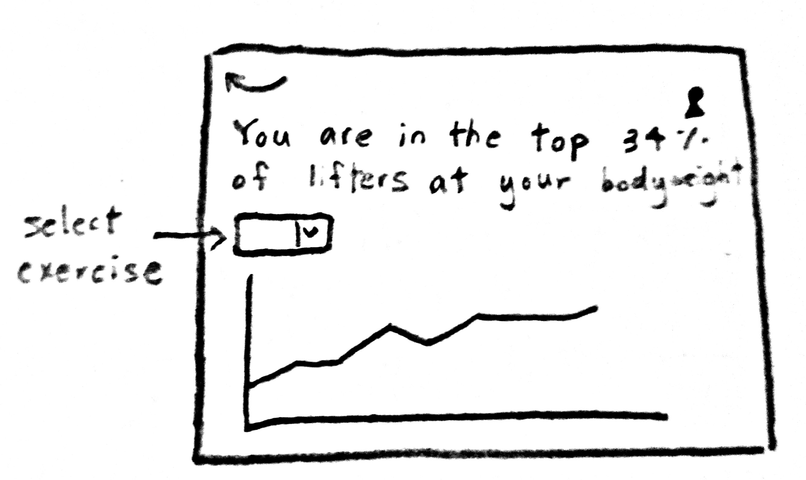

/log - page to search for exercises to log

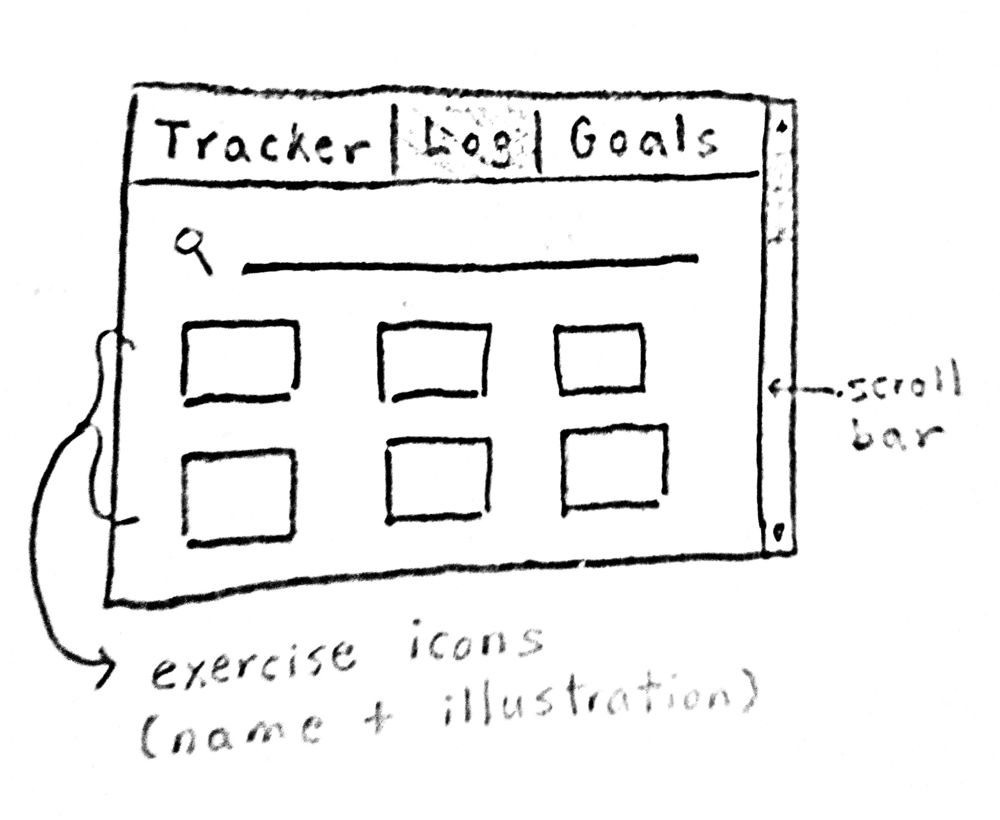

/log/exercise-name - page to log workout associated with exercise-name

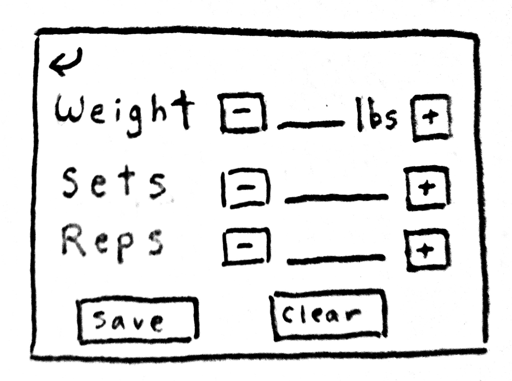

/goals - page to search for exercises to set goals for

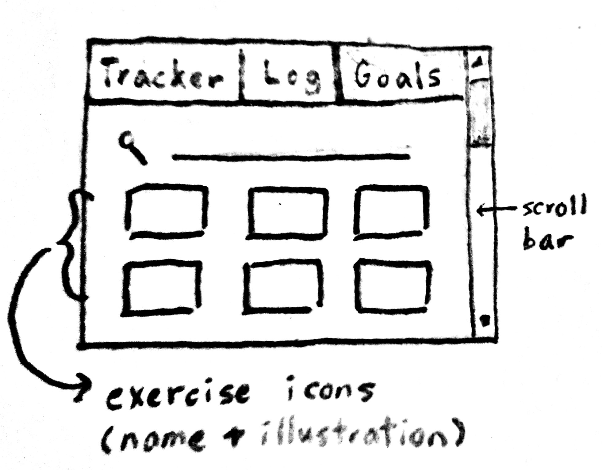

/goals/exercise-name - page to set goal associated with exercise-name

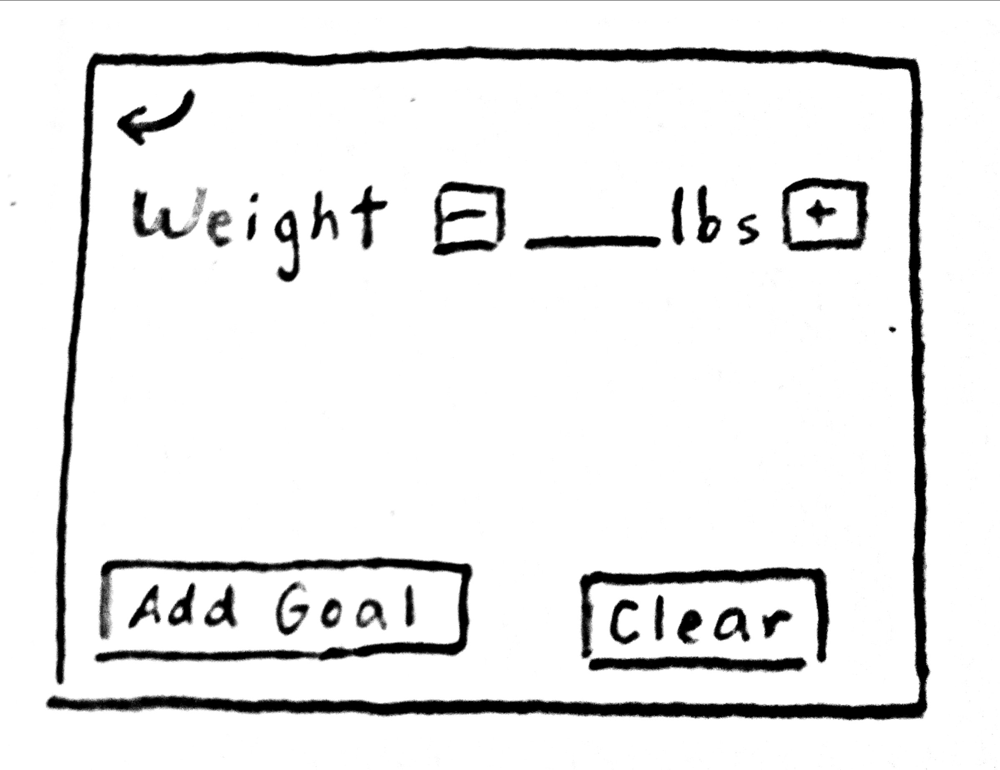


## Site map

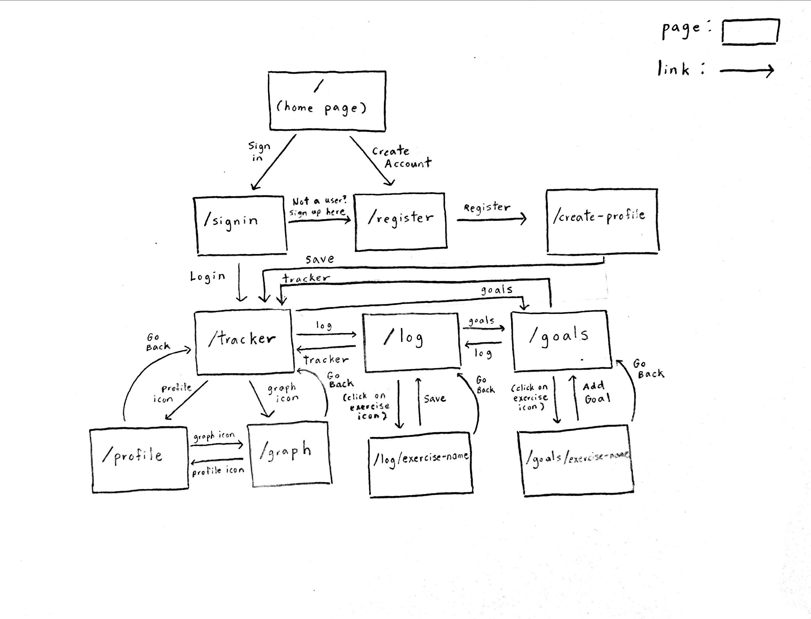


## User Stories or Use Cases

1. as a non-registered user, I can register a new account with the site.
2. as a user, I can log in to the site.
3. as a user, I can log my workout.
4. as a user, I can view my workout history and track my progress over time.
5. as a user, I can compare my one-rep max lift with other lifters at my bodyweight.
6. as a user, I can set goals for myself and be notified when I have reached my goals.

## Research Topics

* (3 points) Unit testing with Javascript
    * I plan on using Mocha and Chai for unit testing.
    * Mocha is a testing framework and Chai is an assertion library.
    * I want to get practice writing good unit tests and writing good code.
* (3 points) Perform client side form validation using custom JavaScript or JavaScript library
    * I want to perform client side form validation so that the user can fix the error straight away.
    * Doing both client and server side validation will make the app user-friendly and secure.
    * For now, I plan on using custom Javascript.
* (2 points) Use a CSS framework throughout your site, use a reasonable of customization of the framework (don't just use stock Bootstrap - minimally configure a theme):
    * I plan on using Bootstrap to give the app a cohesive look.
    * I will use either a themer or a customizer to make my design more unique.
    * I will add animations (scroll, hover, load) to make the app more interactive.

8 points total out of 8 required points. 

## [Link to Initial Main Project File](app.js) 


## Research Topic 1 - Unit Testing with Jest
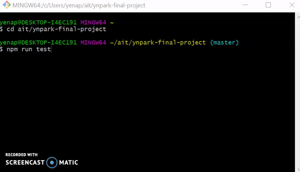


## Research Topic 2 - Automate Linting with Gulp
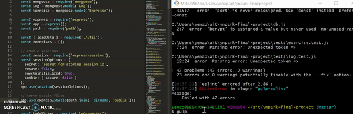


## Annotations / References Used
1. Used [Sample Documentation](https://github.com/nyu-csci-ua-0480-008-spring-2017/final-project-example) as reference for initial set up
2. [Automate Linting with Gulp](https://github.com/nyu-csci-ua-0480-008-spring-2020/ynpark-final-project/blob/master/gulpfile.js) - https://scotch.io/tutorials/automate-your-tasks-easily-with-gulp-js 
3. [Unit Testing with Jest](https://github.com/nyu-csci-ua-0480-008-spring-2020/ynpark-final-project/tree/master/tests) - https://medium.com/javascript-in-plain-english/how-i-setup-unit-test-for-mongodb-using-jest-mongoose-103b772ee164
4. Deploying to Heroku - https://devcenter.heroku.com/articles/getting-started-with-nodejs?singlepage=true, https://devcenter.heroku.com/articles/deploying-nodejs, https://medium.com/make-school/how-to-deploy-your-node-js-mongodb-app-to-the-web-using-heroku-63d4bccf2675
5. Reused some [styling](https://github.com/nyu-csci-ua-0480-008-spring-2020/ynpark-final-project/blob/master/public/css/main.css) from [HW 5](https://github.com/nyu-csci-ua-0480-008-spring-2020/ynpark-homework05)